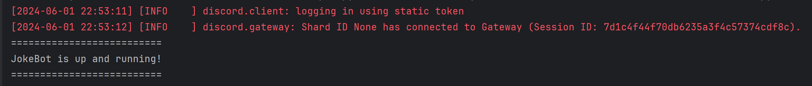
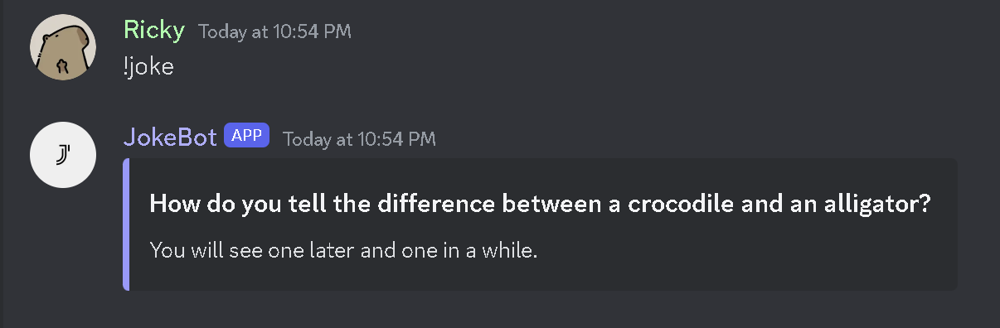
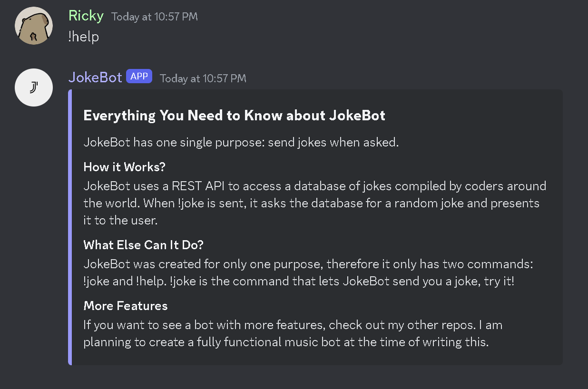

<h1 align="center" id="title">JokeBot</h1>

JokeBot is a Discord chatbot created using Python 3.0 and the discord.py library. Its sole function is to send a random joke to the user when the user runs the associated command. The additonal packages that need to be installed before using are:

<ol>
  <li>discord</li>
  <li>requests</li>
  <li>DiscordUtils</li>
  <li>commands from discord.ext</li>
  <li>json</li>
</ol>

<h2>Project Screenshots:</h2>

<h3>The Python Console Upon Startup</h3>

<h3>The !joke Command In Use</h3>

<h3>The !help Command In Use</h3>

<h2>License</h2>

This is a public repository hosted on GitHub. If you wish to fork or use my code, please credit me using a comment in your code.

